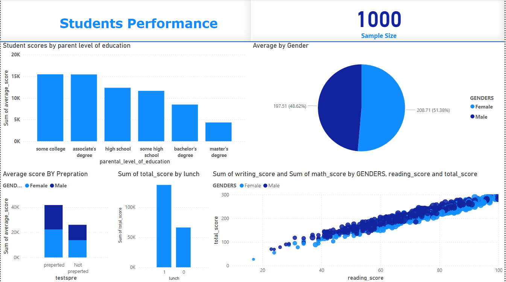

# 🎓 Student Performance Analysis

## 📌 Project Overview

This project analyzes student performance based on multiple factors such as gender, parental education level, test preparation, and lunch type.
The goal is to uncover patterns and insights that impact student academic success.

## 📊 Dataset

* Source: Public dataset (Kaggle / Online)
* Records: 1000 students
* Features:

  * Gender
  * Parental Level of Education
  * Lunch Type
  * Test Preparation Course
  * Math, Reading, Writing Scores

## 🛠 Tools & Technologies

* Power BI
* Data Cleaning & Transformation
* Data Visualization
* DAX Measures

---

## 📈 Dashboard Preview
🖼 Dashboard Preview

## 🔍 Key Insights

### 1. Gender Performance

* Female students slightly outperform males in overall average scores.

### 2. Test Preparation Impact

* Students who completed test preparation scored significantly higher.

### 3. Parental Education Influence

* Higher parental education correlates with better student performance.

### 4. Lunch Factor

* Students with standard lunch tend to perform better than those with free/reduced lunch.

## 📌 Conclusion

Student performance is strongly influenced by preparation, family background, and available resources.
Targeted educational support can significantly improve outcomes.

## 🚀 Future Improvements

* Add predictive model (Machine Learning)
* Include more demographic variables
* Build interactive filters for deeper insights

## 👩‍💻 Maab Faisal
- LinkedIn: (http://linkedin.com/in/maab-faisal-291a52219)
